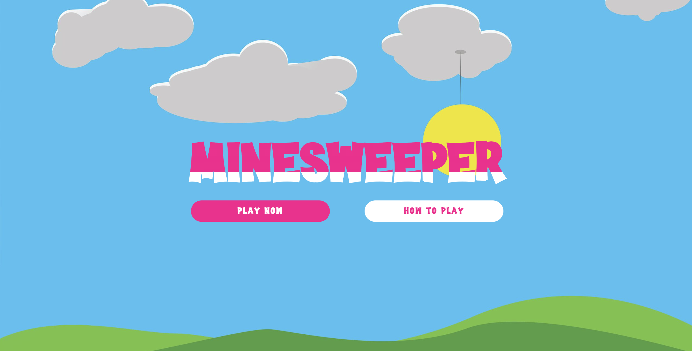
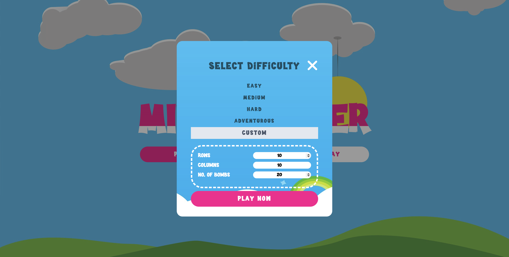
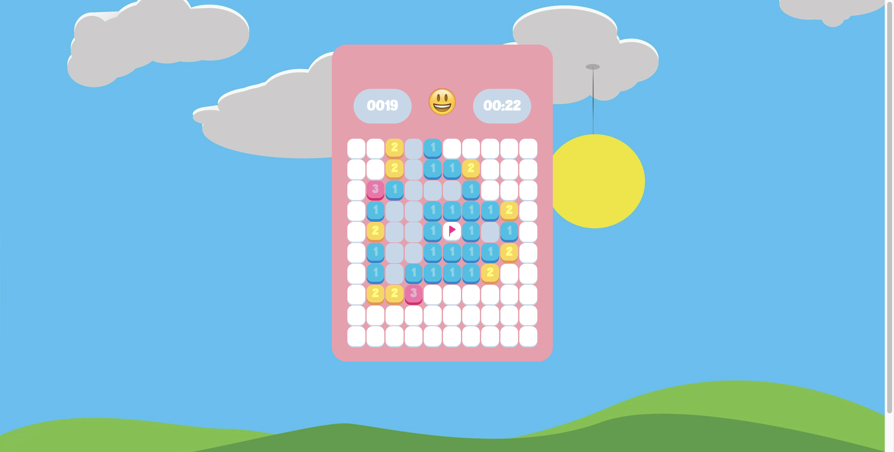

# Minesweeper-Game

A classic minesweeper game that helps to keep your mind off of your daunting tasks!

## How To Play

**Left-click** to reveal a tile.  
**Right-click** to flag a tile. To un-flag a tile that has been flagged, simply right-click on that same tile again.

Game ends when a tile containing :bomb: is revealed :wink: 
Ready to play now? [Click here](https://minesweeper-prj.netlify.app/) to start your game!

## Game Window

1. Main game loading page
   

2. Game difficulty selection
   

3. Game window
   

## Technologies

1. Javascript
2. HTML
3. CSS

## Further Work To Be Done

1. To include game count-down timer.
